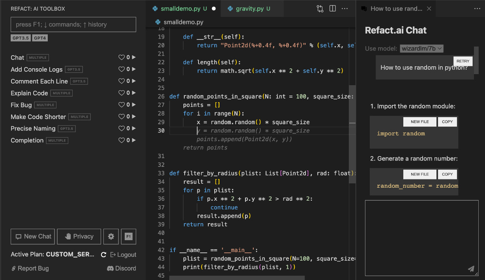

# Refact AI

Refact is an open-source Copilot alternative available as a self-hosted or cloud option.

---

[](https://smallcloud.ai/discord)
[](https://twitter.com/intent/follow?screen_name=refact_ai)

[](https://marketplace.visualstudio.com/items?itemName=smallcloud.codify)
[](https://plugins.jetbrains.com/plugin/20647-codify)

- [x] Autocompletion powered by best-in-class open-source code models
- [x] Context-aware chat on a current file
- [x] Refactor, explain, analyse, optimise code, and fix bug functions
- [x] Fine-tuning on codebase (Beta, self-hosted only) [Docs](https://refact.ai/docs/fine-tuning/)
- [ ] Context-aware chat on entire codebase



## Getting Started

Download Refact for [VS Code](https://marketplace.visualstudio.com/items?itemName=smallcloud.codify) or [JetBrains](https://plugins.jetbrains.com/plugin/20647-refact-ai).

You can start using Refact Cloud immediately, just create an account at [https://refact.ai/](https://refact.ai/).

Instructions below are for the self-hosted version.


### Running Refact Self-Hosted in a Docker Container

The easiest way to run the self-hosted server is a pre-build Docker image.

Install [Docker with NVidia GPU support](https://docs.nvidia.com/datacenter/cloud-native/container-toolkit/install-guide.html#docker).
On Windows you need to install WSL 2 first, [one guide to do this](https://docs.docker.com/desktop/install/windows-install).


Run docker container with following command:
```commandline
docker run -d --rm -p 8008:8008 -v perm-storage:/perm_storage --gpus all smallcloud/refact_self_hosting
```

`perm-storage` is a volume that is mounted inside the container. All the configuration files,
downloaded weights and logs are stored here.

To upgrade the docker, delete it using `docker kill XXX` (the volume `perm-storage` will retain your
data), run `docker pull smallcloud/refact_self_hosting` and run it again.

Now you can visit http://127.0.0.1:8008 to see the server Web GUI.


<details><summary>Docker commands super short refresher</summary>
Add your yourself to docker group to run docker without sudo (works for Linux):

```commandline
sudo usermod -aG docker {your user}
```

List all containers:

```commandline
docker ps -a
```

Start and stop existing containers (stop doesn't remove them):

```commandline
docker start XXX
docker stop XXX
```

Shows messages from a container:
```commandline
docker logs -f XXX
```

Remove a container and all its data (except data inside a volume):
```commandline
docker rm XXX
```

Check out or delete a docker volume:
```commandline
docker volume inspect VVV
docker volume rm VVV
```
</details>

See [CONTRIBUTING.md](CONTRIBUTING.md) for installation without a docker container.


### Setting Up Plugins

Go to plugin settings and set up a custom inference URL `http://127.0.0.1:8008`

<details><summary>JetBrains</summary>
Settings > Tools > Refact.ai > Advanced > Inference URL
</details>
<details><summary>VSCode</summary>
Extensions > Refact.ai Assistant > Settings > Infurl
</details>


## How Refact Works

Under the hood, it uses Refact models and the best open-source models.

At the moment, you can choose between the following models:

| Model                                                                                | Completion | Chat | AI Toolbox | Fine-tuning |
|--------------------------------------------------------------------------------------|------------|------|------------|-------------|
| [Refact/1.6B](https://huggingface.co/smallcloudai/Refact-1_6B-fim)                   | +          | +    |            |             |
| [CONTRASTcode/medium/multi](https://huggingface.co/smallcloudai/codify_medium_multi) | +          |      |            | +           |
| [CONTRASTcode/3b/multi](https://huggingface.co/smallcloudai/codify_3b_multi)         | +          |      |            | +           |
| [starcoder/15b/base](https://huggingface.co/TheBloke/starcoder-GPTQ)                 | +          |      |            |             |
| [starcoder/15b/plus](https://huggingface.co/TheBloke/starcoderplus-GPTQ)             | +          |      |            |             |
| [wizardcoder/15b](https://huggingface.co/TheBloke/WizardCoder-15B-1.0-GPTQ)          | +          |      |            |             |
| [codellama/7b](https://huggingface.co/TheBloke/CodeLlama-7B-fp16)                    | +          |      |            |             |
| [starchat/15b/beta](https://huggingface.co/TheBloke/starchat-beta-GPTQ)              |            | +    |            |             |
| [wizardlm/7b](https://huggingface.co/TheBloke/WizardLM-7B-V1.0-Uncensored-GPTQ)      |            | +    |            |             |
| [wizardlm/13b](https://huggingface.co/TheBloke/WizardLM-13B-V1.1-GPTQ)               |            | +    |            |             |
| [llama2/7b](https://huggingface.co/TheBloke/Llama-2-7b-Chat-GPTQ)                    |            | +    |            |             |
| [llama2/13b](https://huggingface.co/TheBloke/Llama-2-13B-chat-GPTQ)                  |            | +    |            |             |


## Usage

Refact is free to use for individuals and small teams under BSD-3-Clause license. If you wish to use Refact for Enterprise, please [contact us](https://refact.ai/contact/).

## FAQ

Q: Can I run a model on CPU?

A: it doesn't run on CPU yet, but it's certainly possible to implement this.

Q: Sharding is disabled, why?

A: It's not ready yet, but it's coming soon.

## Community & Support

- Contributing [CONTRIBUTING.md](CONTRIBUTING.md)
- [GitHub issues](https://github.com/smallcloudai/refact/issues) for bugs and errors
- [Community forum](https://github.com/smallcloudai/refact/discussions) for community support and discussions
- [Discord](https://www.smallcloud.ai/discord) for chatting with community members
- [Twitter](https://twitter.com/refact_ai) for product news and updates

