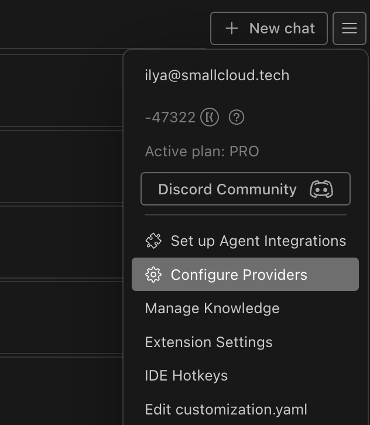
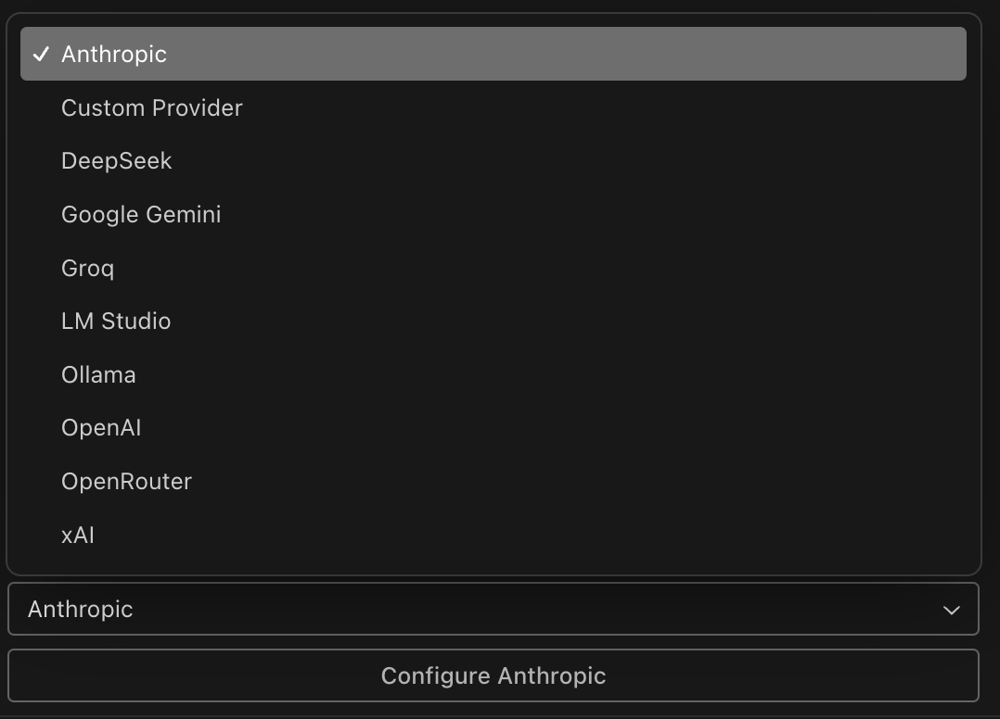
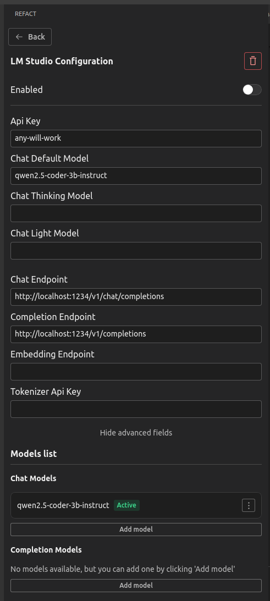
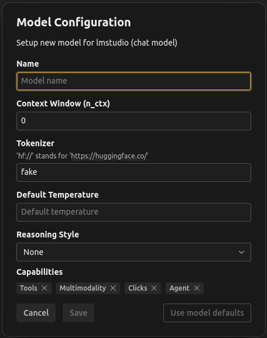
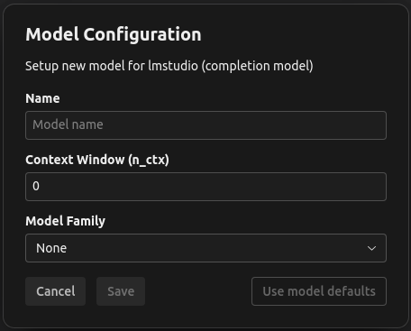

# Introduction

The **Configure Providers** feature (also known as BYOK – Bring Your Own Key) allows you to connect your own API keys for supported AI providers, giving you full control over which models you use and how you are billed.

---

## What is "Configure Providers" (BYOK)?

- **Bring Your Own Key (BYOK)** lets you use your own API keys for services like OpenAI, Anthropic, DeepSeek, and others, instead of (or in addition to) Refact’s built-in cloud models.
- This is ideal if you have your own API access, want to use specific models, or need to keep billing and data usage under your own account.

---

## Supported Providers

You can connect API keys for:
- **OpenAI** (e.g., GPT-3.5, GPT-4, GPT-4o, etc.)
- **Anthropic** (e.g., Claude models)
- **DeepSeek** (e.g., deepseek-chat, deepseek-reasoner)
- **Local models** (if supported by your Refact instance)
- Other providers as they become available

---

## How to Configure Providers (Step-by-Step)

### 1. Open the Providers Menu

- In the Refact plugin, click the menu button (three horizontal lines or "burger" icon) in the top right corner.
- Select **Configure Providers** from the dropdown menu.

  

---

### 2. Add a New Provider

- In the **Configure Providers** window, click **Add Provider** or the "+" button.
- Choose your provider from the list (e.g., OpenAI, Anthropic, DeepSeek).

  

---

### 3. Enter Your API Key and Configure Provider Settings

- Paste your API key into the field provided.
- (Optional) Give the provider a custom name for easy identification.
- Enable or disable the provider as needed.
- Click **Save**.

  

---

### 4. Configure Models for Each Provider

- For each provider, you can add and configure models for the tasks that provider supports (such as **Chat**, **Completion**, or **Embeddings**).
- The available model types and settings will depend on the provider you select.
- Click **Add model** to open the model configuration dialog.

  

  

#### Model Configuration Fields
- **Name**: The model’s name/ID (e.g., `gpt-4o`, `deepseek-chat`).
- **Context Window (n_ctx)**: Maximum context length (tokens) the model can handle.
- **Tokenizer**: The tokenizer to use (e.g., `hf://` for HuggingFace models).
- **Default Temperature**: Controls randomness/creativity of model outputs.
- **Reasoning Style**: (Dropdown) Choose a reasoning style, if supported.
- **Capabilities**: Select which features the model supports (Tools, Multimodality, Clicks, Agent, etc.).

---

### 5. Switch Between Providers and Models

- You can add multiple providers and models, and switch between them at any time.
- The currently active provider/model will be used for new requests.

---

## Billing and Usage

- **When using BYOK, your requests are billed directly by the provider (e.g., OpenAI, Anthropic, DeepSeek).**
- **Refact coins are NOT consumed** for BYOK requests.
- You are responsible for monitoring your API usage and costs with your provider.

---

## Best Practices & Troubleshooting

- **Keep your API keys secure.** Never share them publicly.
- If a provider or model is not working, double-check your API key, model name, and account status.
- Some providers may have usage limits or require specific permissions.
- For help, visit our [Discord Community](https://smallcloud.ai/discord) or check the FAQ.

---

## FAQ

**Q: Can I use multiple providers at once?**  
A: Yes! You can add and switch between multiple providers as needed.

**Q: What happens if my API key runs out of credit?**  
A: Requests will fail until you add more credit or switch to another provider.

---

For more help, see our [FAQ](/faq/) or contact support.
