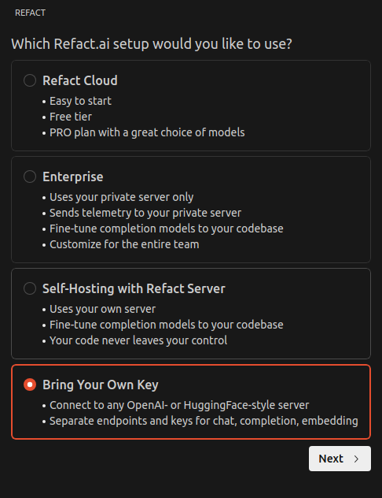
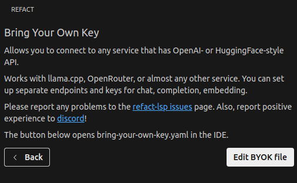
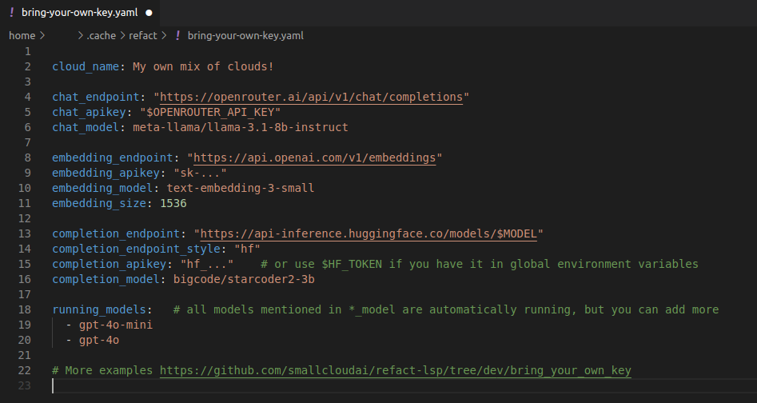

## Introduction
Bring Your Own Key (BYOK) allows users to specify their API keys and select models for chat, completion, and embedding tasks across different AI platforms. This feature enables seamless integration with various services while maintaining control over API keys.
The Bring Your Own Key (BYOK) feature allows users to specify their API keys and select models for chat, completion, and embedding tasks across various AI platforms. This functionality ensures seamless integration with different services while providing users with control over their API keys.

## Configuration Steps

Select the **Bring Your Own Key** option and click the **Next** button.

Click on **Edit BYOK file** to open the `bring-your-own-key.yaml` file:

In the file, specify your API key, model name, and endpoints as necessary.

## Additional Resources
For more examples and configurations, please visit the [Refact GitHub repository](https://github.com/smallcloudai/refact-lsp/tree/main/bring_your_own_key).