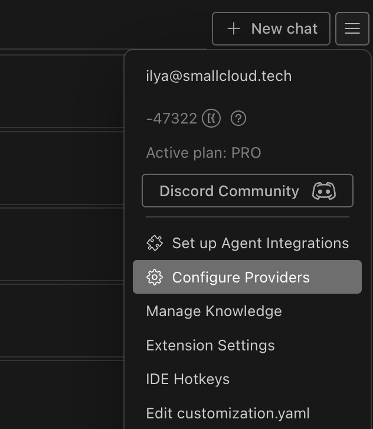
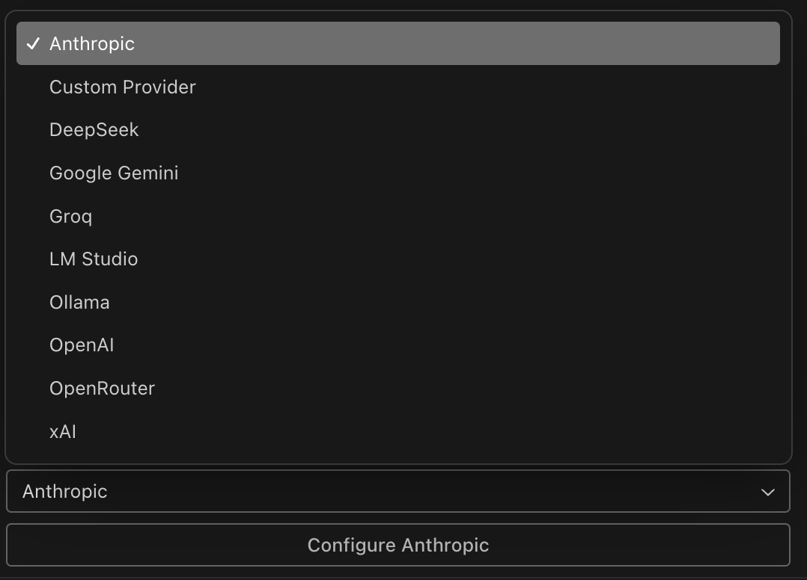

## Introduction

Bring Your Own Key (BYOK) allows users to specify their API keys and select models for chat, completion, and embedding tasks across different AI platforms. This feature enables seamless integration with various services while maintaining control over API keys.

## How to Switch Providers in the Plugin

By default, your provider is Refact.ai Cloud. If you want to switch from it, follow these steps:

1. Navigate to the "Burger" button in the right upper corner of the plugin interface and click it.
2. Go to the "Configure providers" tab and click it. 
   
3. Choose the provider you want to add from the list. 
   
4. You can enable or disable providers and delete them if needed.

## Additional Resources

For more examples and configurations, please visit the [Refact GitHub repository](https://github.com/smallcloudai/refact-lsp/tree/main/bring_your_own_key).
