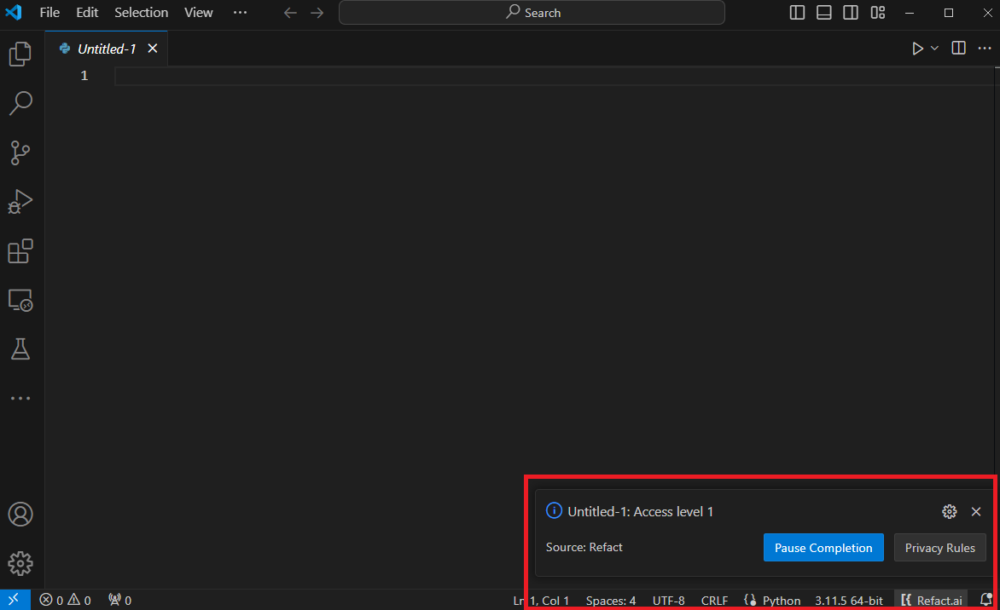

Refact offers a powerful AI-driven code completion feature. 

## How It Works

Refact utilizes a technique called **Fill-in-the-middle** (FIM), where the context before and after your cursor is considered to predict and insert the most relevant code snippets.

## Code Completion Models

- **Cloud Version**: The cloud version of Refact uses the `Refact-1.6-fim` and `starcoder2/3b` model.
- **Self-Hosted Version**: If you opt for the self-hosted version, you have the flexibility to choose from a variety of models. For a detailed list of available models, refer to the [Supported Models](https://docs.refact.ai/supported-models/) section of the documentation.
- **Enterprise Version**: The enterprise version of Refact allows you to use the models available in the Self-hosted version and additional vLLM models.

## Key Features

### **Context Length**
Refact analyzes the code up to a certain length to provide suggestions.
Context length depends on the plan you have chosen for your account:
- **Free**: 2048 tokens 
- **Pro**: 4096 tokens

### **Cache Mechanism** 
To enhance performance, Refact caches previous computations and suggestions.
 
This cache helps in reducing latency and improving the responsiveness of the autocomplete feature, especially during repeated coding patterns or when similar code contexts are encountered. 

To avoid cached suggestions, you can press `spacebar`.

**Force completion** is a way to avoid the cached suggestions and trigger the autocomplete feature manually.

### **Force Completion** 
Force completion is a shortcut that can be used to trigger the autocomplete feature manually.

This can be configured in your IDE's keyboard shortcuts settings. The default shortcut is `Alt + Space` on Windows and `Opt + Space` on macOS.

## Disabling Code Completion

You can disable code completion by pressing the Refact logo at the status bar and clicking on the `Pause Completion` button.

## Privacy

Privacy settings allow you to control the level of confidentiality to ensure the confidentiality of your code. 

There are three levels of privacy you can choose from in Refact.
Levels of privacy can be modified in the plugin dashboard. 
### Level 0
With this level of privacy, Refact will not have access to files and data won't be sent to a third-party model.

> With this level of privacy you won't be able to use any of the Refact commands like `Explain code` or `Completion`

### Level 1
With Level 1 of privacy, Refact has access to your files but data is protected from sending to a third-party model.

At Refact, your privacy and control over your data are fundamental principles that guide our approach. We are committed to providing a secure and reliable environment for all our users, whether you choose to utilize our cloud services or set up a self-hosted server. Your trust is important to us, and we're here to support your coding journey while safeguarding your data every step of the way.

When working with code blocks that use third-party APIs you will receive an error that indicates you need to switch to a Level 2 privacy in order to get a precise analysis of the code.

#### Refact Cloud Version
When using Refact's cloud version, data is sent to our servers for processing. However, it's important to note that we do not collect datasets on the server side. Your code and information are used solely to enhance your coding experience and provide you with intelligent suggestions.

#### Refact Self-Hosted Version
For users who opt for the self-hosted version of Refact, your data stays within your control. When you run a self-hosted server, your data is sent exclusively to your server. This ensures that your code and information remain within your infrastructure, giving you complete control over your data.

### Level 2
With Level 2 of privacy, Refact has access to files, and data is not protected from sending to third-party models like GPT-3.5
