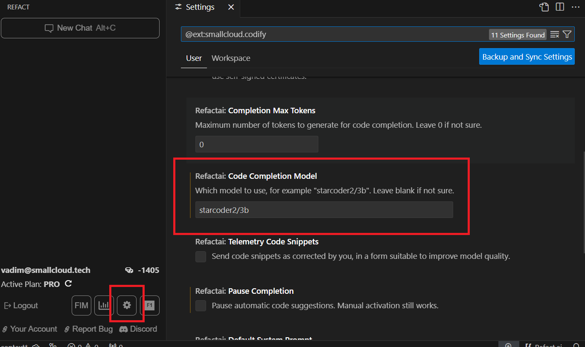
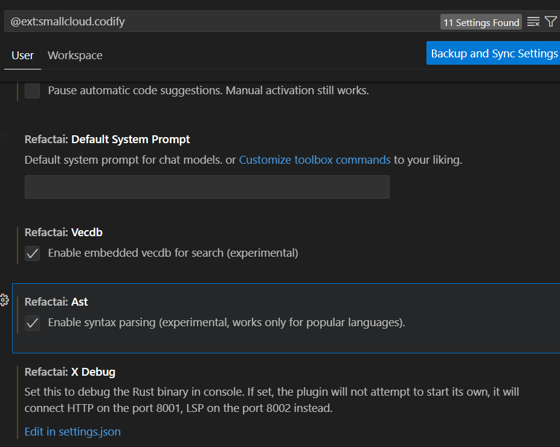
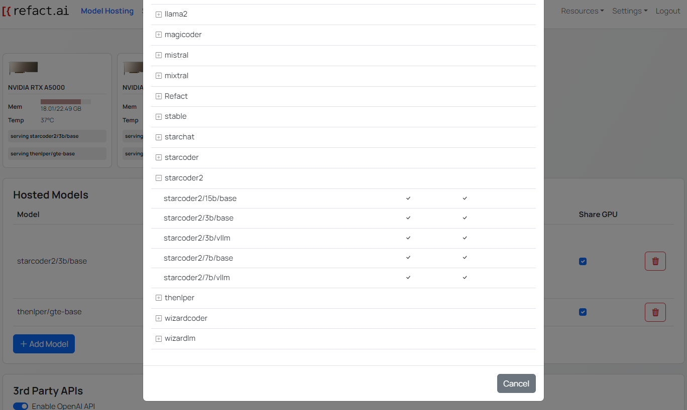
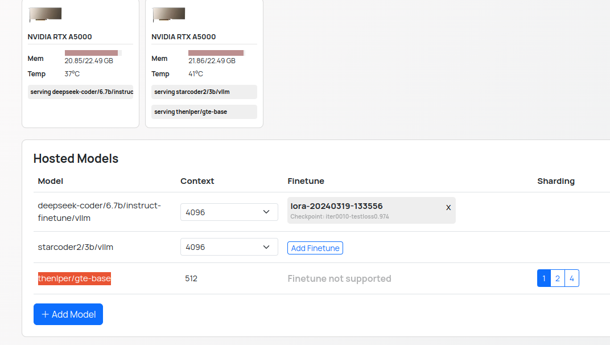

Context refers to the surrounding information that Refact.ai uses to provide a better quality of generated code. This can include:
- **Code Syntax**: By analyzing the current state of the code, Refact.ai can provide syntactically correct code completions.
- **Developer's Intent**: Interpreting comments, variable names, and function signatures, Refact.ai can provide code suggestions that are more relevant to the developer's intent.
- **Repo-level awareness**: By analyzing the repository's codebase, Refact.ai can provide code suggestions that are more relevant to the existing codebase.

## RAG 
Refact.ai uses RAG (Retrieval-Augmented Generation) to fill the 
context with the information that is needed to provide a better quality of generated code.

### Enabling RAG

In order to enable RAG, you need to follow the instructions depending on the version of the Refact.ai you are using.

### Cloud Version

1. In the settings of the plugin (can be accessed by pressing the cogwheel icon in the sidebar), under the `Refactai: Code Completion Model` section, specify the `starcoder2/3b` model.

2. To enable RAG for **code completion**, you need to enable the `Enable syntax parsing` checkbox under the `Refactai: Ast` section.
3. To enable RAG for the **AI chat**, you need to enable the `Enable embedded vecdb for search` checkbox under the `Refactai: Vecdb` section. Read more in the [AI Chat Documentation](https://docs.refact.ai/features/ai-chat/) about available features.

:::note
RAG is more useful for the context size **more than 2048 tokens**, which is available for **Pro users**.

Be aware that RAG indexing is a **high resource-consuming process**, so you will experience increased memory consumption of your **GPU, RAM, and CPU**.
:::
### Refact Enterprise

1. In the Web UI of your Refact.ai instance, navigate to the `Model Hosting` page. press the `Add Model` button to switch the model, locate and select one of the `starcoder2/` models.

:::note
You can use different models from the `starcoder2` family. But be aware that with Stacoder2 models, the results will be more accurate and the code completion will be more accurate.
:::
2. To enable RAG for **code completion**, you need to enable the `Enable syntax parsing` checkbox under the `Refactai: Ast` section.
3. To enable RAG for the **AI chat**, you need to enable the `Enable embedded vecdb for search` checkbox under the `Refactai: Vecdb` section. Read more in the [AI Chat Documentation](https://docs.refact.ai/features/ai-chat/) about available features.

4. If Vecdb checkbox is enabled in your VS Code settings, you need to select the `thenlper/gte-base` model in your Refact.ai instance.
In the Web UI of your Refact.ai instance, navigate to the `Model Hosting` page. Press the `Add Model` button, locate and select the `thenlper/gte-base` model.

:::note
Make sure that you have enough memory available on your GPU for the model to be loaded and served.

Altrnitavely you can use unoccupied GPU to avoid the memory issue and interruption of the code generation.

As an aditional option, you can switch from vLLM model to a regular model.
:::