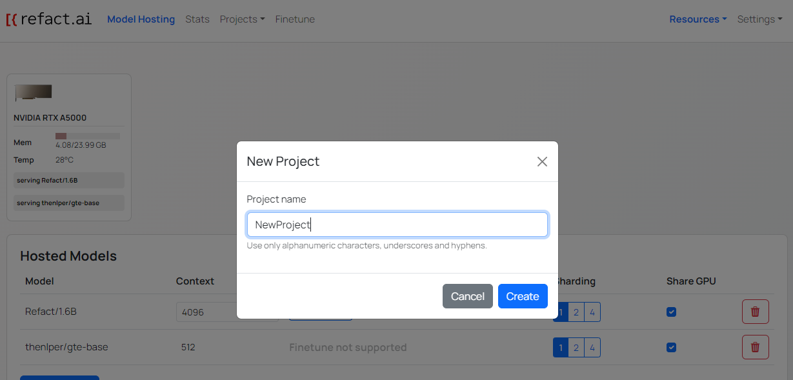
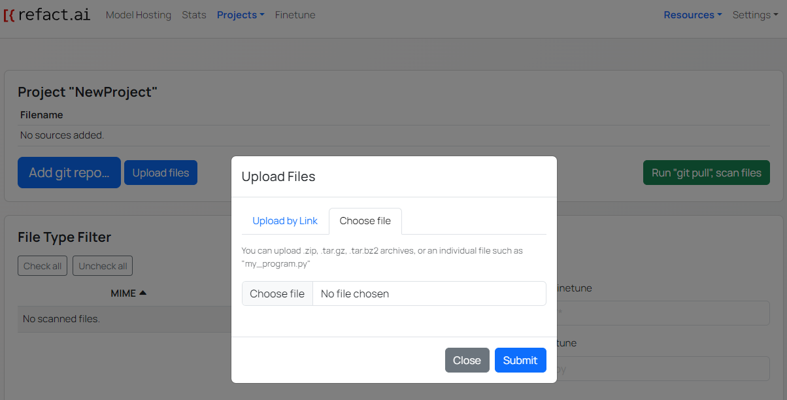
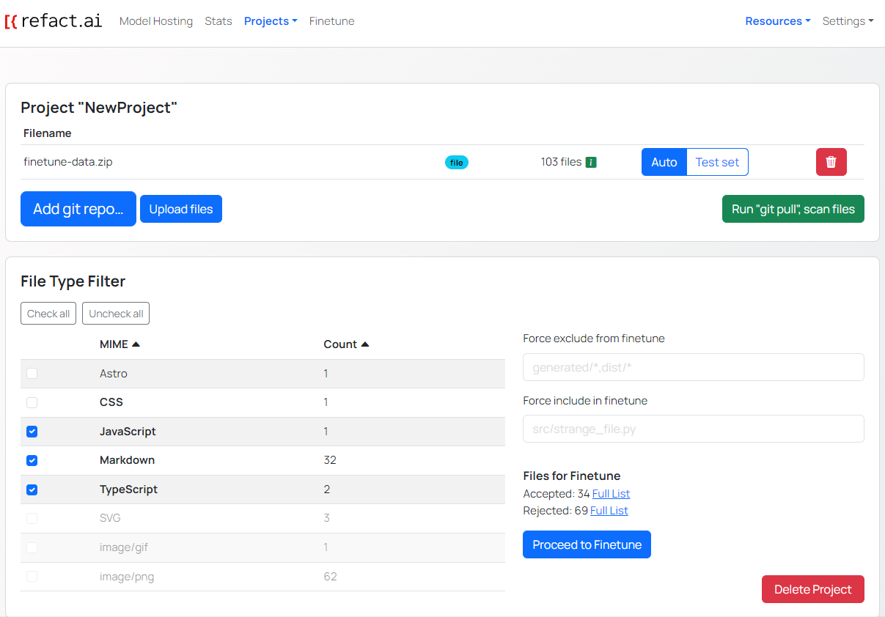
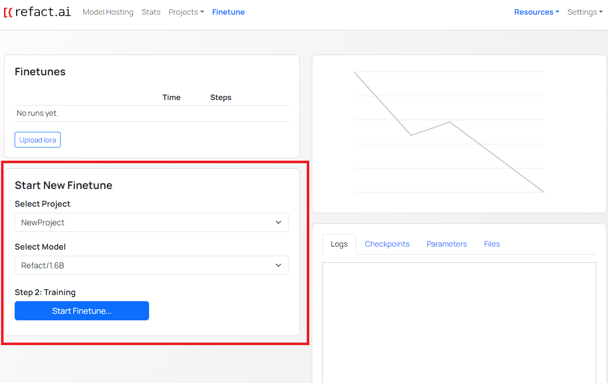
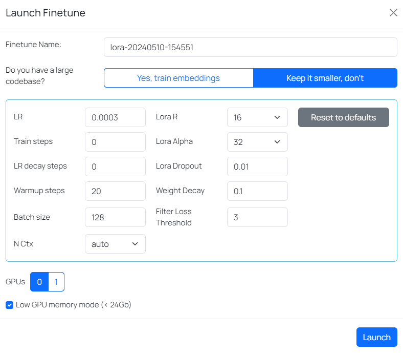
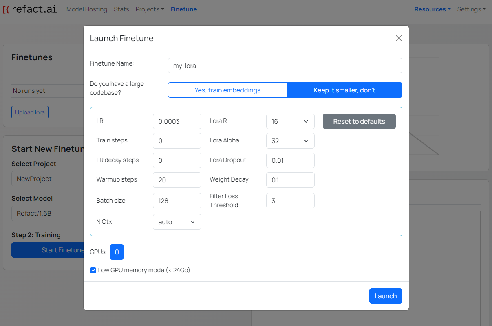
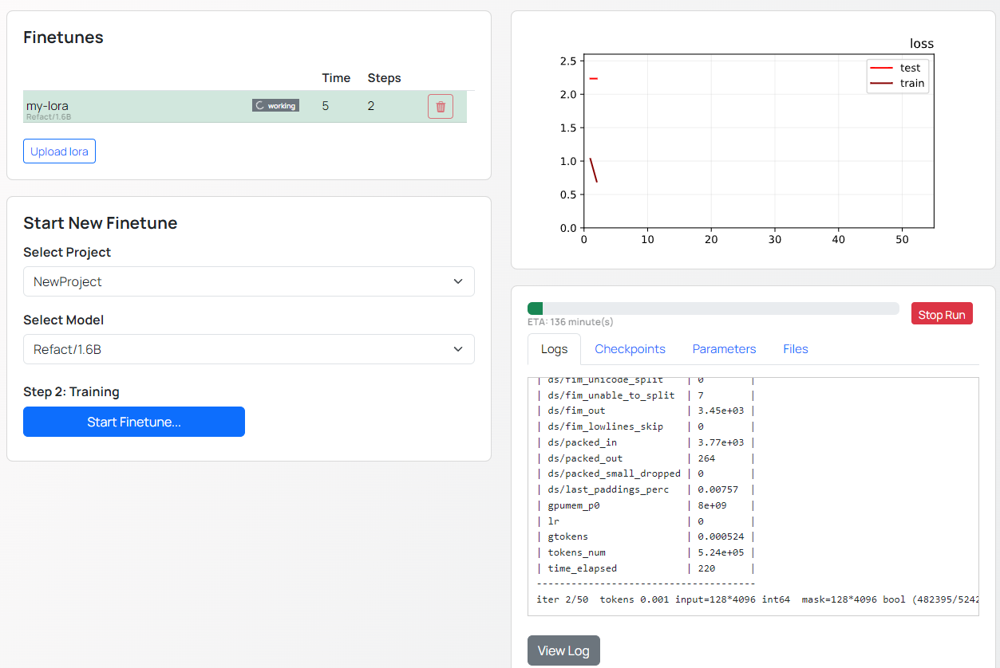
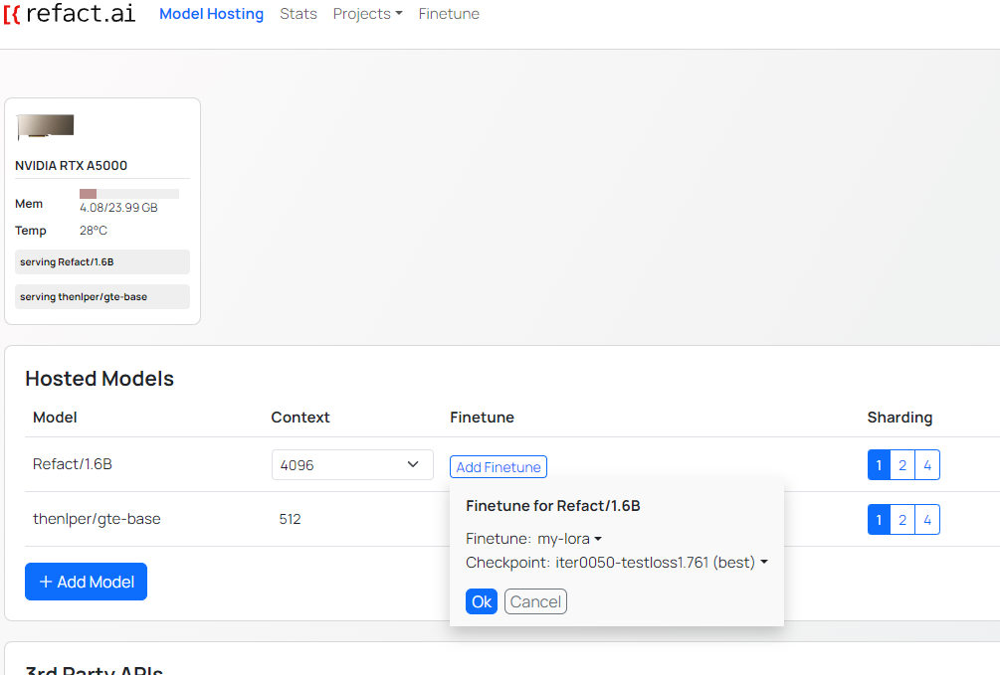
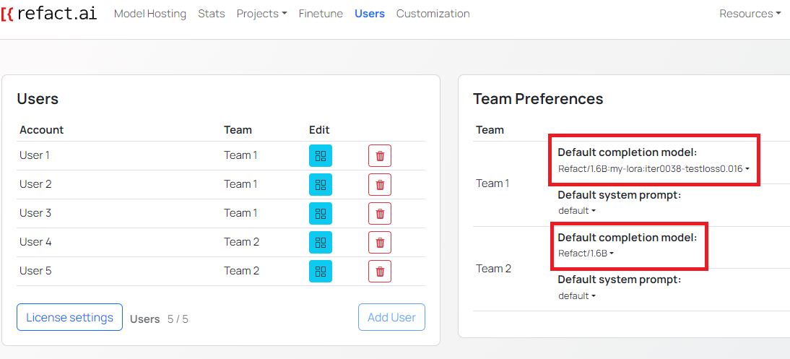

Fine-tuning is a process of pretraining a base model to improve the quality of generated code.

Fine-tuning is supported in the following version of Refact.ai:
- [Self-hosted Refact](https://docs.refact.ai/guides/version-specific/self-hosted/)
- [Enterprise Refact](https://docs.refact.ai/guides/version-specific/enterprise/getting-started/)

## Use-cases

Fine-tuning can be particularly useful for:
- Adapting the model to a specific programming language.
- Customizing the model for a particular technology stack.
- Aligning the model outputs with a predefined style guide.

## Creating a Fine-Tuned Model

### Create a Project
1. Navigate to the `Projects` dropdown.
2. Click the `New Project` button or choose an existing project if applicable.
3. In the pop-up window, enter the project name and click `Create`.

### Add Fine-Tuning Data
You can add data for fine-tuning through the following methods:
- **Add Git Repository**:
  - For public repositories, use an HTTPS link: `https://github.com/my_company/my_repo`.
  - For private repositories, ensure an SSH Key is added, then use an SSH link: `git@github.com:my_company/my_repo.git`.
  - Optionally, specify the branch to pull data from.
- **Upload Files**:
  - **By Link**: Enter the URL of the file (e.g., `https://yourserver.com/file.zip`). Make sure to use a direct URL.
  - **From Local Storage**: Click `Choose file` and select the file to upload from your local device.

### Scan and Filter Files
1. Click `Run 'git pull', scan files`.
2. After scanning, the file types and counts are displayed in the **File Type Filter** section.
3. Select the file types you want to fine-tune with checkboxes. Details on accepted and rejected files are available by clicking the **Full List** button.
:::note
For rejected files, reasons for rejection are provided next to each file name. To include rejected files, specify directory paths or paths to specific files in the **Include** section.
:::

### Start Fine-Tuning
1. Click `Proceed to Fine-tuning` or navigate to the **Finetune** page.
2. In the **Start New Finetune** page, select the project created during the previous steps.
3. Select the model you want to fine-tune from the **Select Model** dropdown.

2. On the fine-tuning page, click `Start Fine-tuning`.
3. In the pop-up, name your fine-tuning session and select:
   - **Train embeddings** for large code bases.
   - **Keep it smaller** for smaller code bases.
   - **GPUs** - select the number of the GPU to use for fine-tuning (number of the GPU starting from 0). If you have multiple GPUs, you can select more than one GPU.
   
   - Alternatively, manually adjust fine-tuning settings like model capacity or training schedule.

### Monitor Fine-Tuning
Once the fine-tuning is started, you can monitor the progress in the **Finetune** page.

On the right side, the following information is displayed:
- **Chart** - shows the results of the fine-tuning
- **ETA bar** - shows the estimated time remaining
- **Information** - provides the following information:
  - **Logs** - shows the logs of the fine-tuning
  - **Checkpoints** - lists the checkpoints created during the fine-tuning
  - **Parameters** - provides information about the parameters used during the fine-tuning
  - **Files** - provides information about the files used during the fine-tuning

### Select the Base Model
Once the fine-tuning is completed, navigate to the **Model Hosting** page and click `Add Model` to choose the base model.

:::note
Refact.ai offers a variety of base models. Ensure you select the same model used during fine-tuning.
:::

After selecting the model, select the newly created lora **(the result of fine-tuning, which will act as a patch to the base model)** in the **Finetune** row.

### Enabling Fine-Tuning for Teams

With **Refact.ai Enterprise**, you can enable different fine-tuning options for different teams.

Navigate to the **Users** page. You will see a list of all users and **Team Preferences** section.

You can specify the completion model. When having multiple projects and fine-tuned models, you can specify the completion model for each project.

