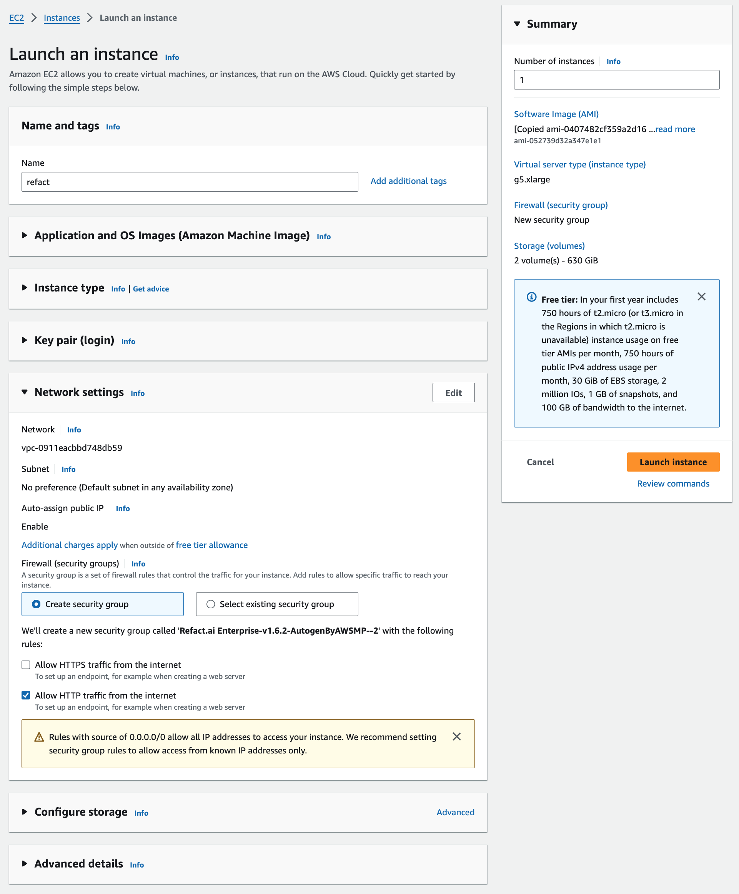

When deploying Refact.ai through the Amazon EC2 Console, you will see the form with pre-filled values. Only two of these values need to be manually changed.

## Instance Name

The instance name is the name that will be used to identify the instance in the AWS console. This value needs to be entered manually.

## Application and OS Images (Amazon Machine Image)

AMI (Amazon Machine Image) is the template that is responsible for containing the Refact.ai configurations. The AMI is pre-selected and does not need to be changed.

## Instance Type

The instance type is pre-selected and does not need to be changed.

:::note
`g5` family instance types are recommended for production use. Contact Refact.ai team for recommendation on the amount of GPUs suitable for your use case.
:::

## Key Pair (Optional)

The key pair is necessary for SSH connections to your EC2 instance.
To create a key pair press the `Create Key Pair` button.

## Network Settings

The network settings are pre-selected and do not need to be changed.
The values should match the onees on the screenshot below.

After verifying the settings, click on the `Launch Instance` button.
You will see the following screen, confirming that the instance is being created.

