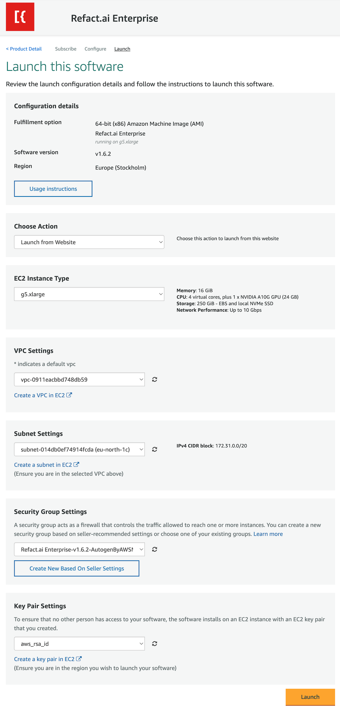
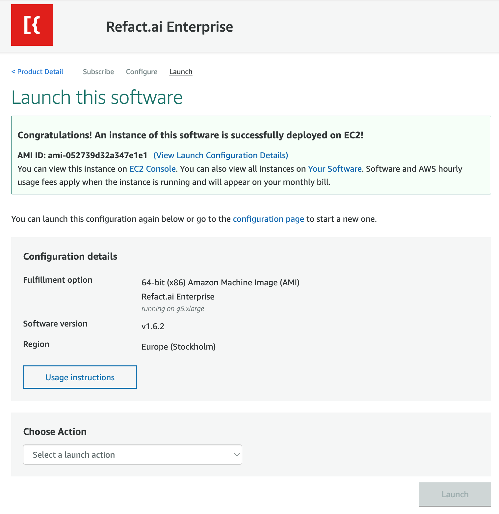

When selecting the option to deploy Refact.ai through the Marketplace page, you will be presented with a screen that will have everything pre-configured for you.

Once you click on the Launch button, you will be presented with a screen that will confirm that your instance is successfully deployed.

