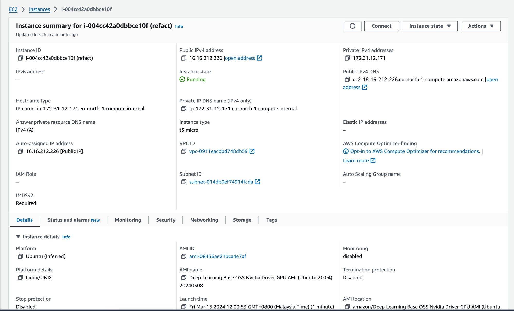
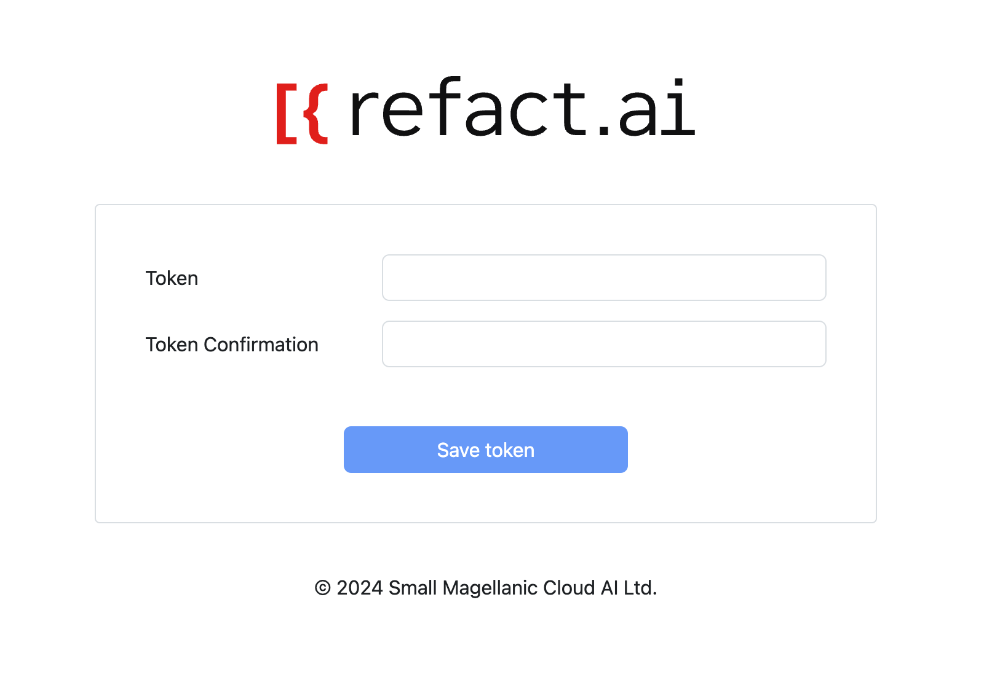

In order to use your Refact.ai instance on AWS, you need to navigate to the AWS Console and locate the newly created instance.

In the instance summary, locate the `Public IPv4 DNS`. This is the value you will need to use to access your instance. 

After navigating to the instance, you will need to create an access token to use with Refact.ai.

Once you have created the token, you need to activate your Refact.ai license. Navigate to the [License Activation Giude](https://docs.refact.ai/guides/version-specific/enterprise/license/) for more information.