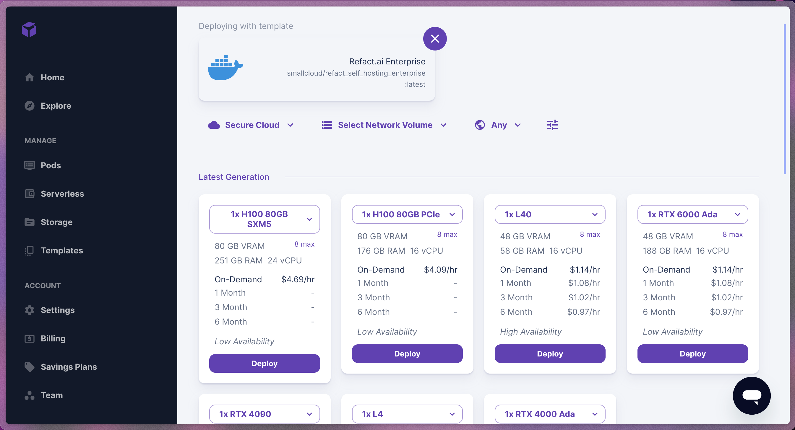
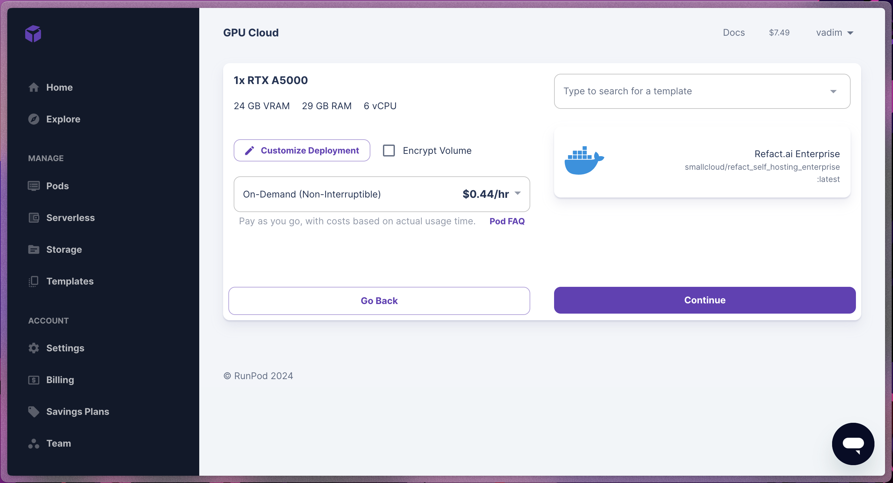
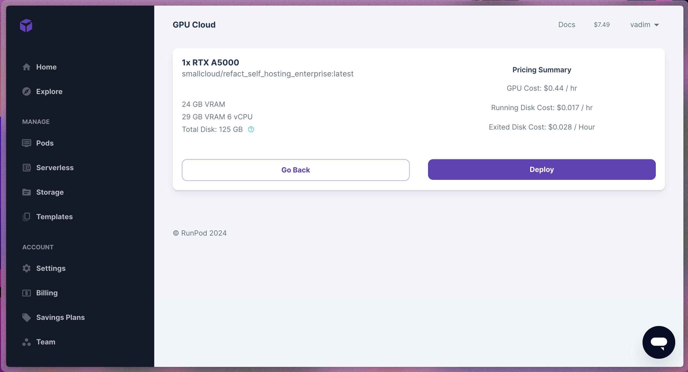
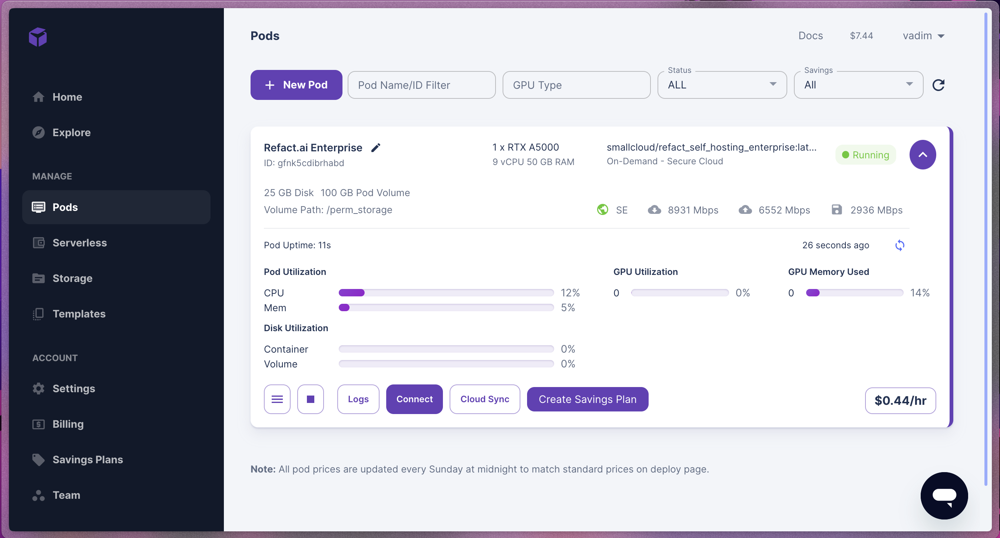
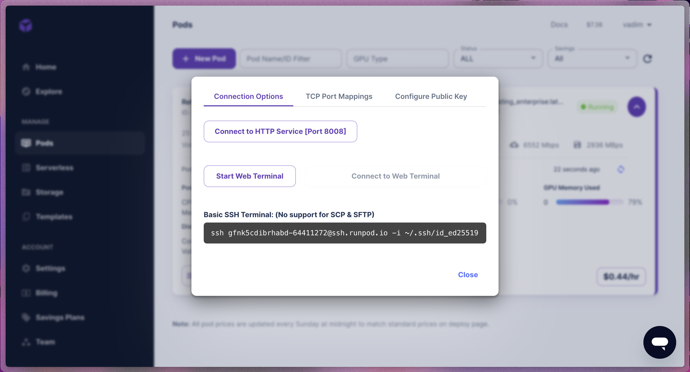

## What is Runpod
Runpod is a GPU Cloud service designed for AI applications.

It is designed to simplify the deployment process of the application. For more information, visit [runpod.io](https://www.runpod.io/).
## Using Refact.ai Templates
Refact distributes templates to simplify the bootstrapping process. There are two templates available:
- [Refact.ai self-hosted](https://runpod.io/gsc?template=gyscn6cs4i&ref=jlbympsh)
- [Refact.ai Enterprise](https://runpod.io/gsc?template=ki0zwfnj98&ref=jlbympsh)

Use the links above to create an instance with a template attached to the pod.
## Selecting a GPU for the Refact.ai Instance
Once you click the link to the template, you will navigate to the page where you need to specify the GPU you want to use. 

Each GPU is represented as a card with the following information:
- Drop down with a type of GPU. Here, you can specify the number of GPUs you want to use. By default, one GPU is selected.
- VRAM for a specific GPU
- Pricing plan

Once you pick the GPU, press the `Deploy` button to proceed.
## Deploying the Refact.ai Instance
In the next step, you will see a card with the settings of your GPU cloud before deploying it with the following information:
- Selected GPU
- Pricing plan
- Template that is used for the deployment

Once confirmed that everything is specified correctly, press the `Continue` button or `Go back` to select a different type or amount of GPUs.

After pressing the `Continue` button, you will see the summary of the instance you are about to deploy. 

The deployment process will start automatically when pressing the `Deploy` button. 
## Refact.ai Instance Configuration
Your newly created pod comes fully configured because of the bootstrapping with a Refact.ai template.

### Pod Settings
To see the settings of your pod, press the burger icon at the bottom left side of the pod card. Inside the dropdown, press the `Edit pod` button.

In the modal window, you will see the following information about the instance:
- Docker image name
- Container disk
- Volume disk - can be modified if more space is required
- Volume mount path - do not modify this field
- Env variables
	- Admin token - specify a password you will use to access the Refact.ai interface (for the Refact.ai Enterprise instance)
    - Can be exteneded with variables that are available with Runpod. The list can be verified in the [Rundpod documentation](https://docs.runpod.io/docs/pod-env-variables).
### Connecting to Refact.ai Instance
In the Runpod UI, press the `Connect` button to see different connection options.

#### Connecting to Web GUI 
By pressing the `Connect to HTTP Service [Port 8008]` button, you will be redirected to a new page  where you will see the Refact.ai login page
#### Runpod Web Terminal
By pressing the `Start Web Terminal`, you can access your pod through the terminal integrated into the Runpod UI.
#### Connecting Through Your Local Terminal
You can access your instance through your local terminal by copying the value under the `Basic SSH Terminal`.

:::caution 
Make sure you added the public SSH key in the pod settings as a value for the `Public key` environmental variable.
:::

## Network Volume
In order to save pod settings and stats, Runpod offers a Network Volume. To read more about it, visit [Runpod documentation](https://docs.runpod.io/docs/create-a-network-volume).
