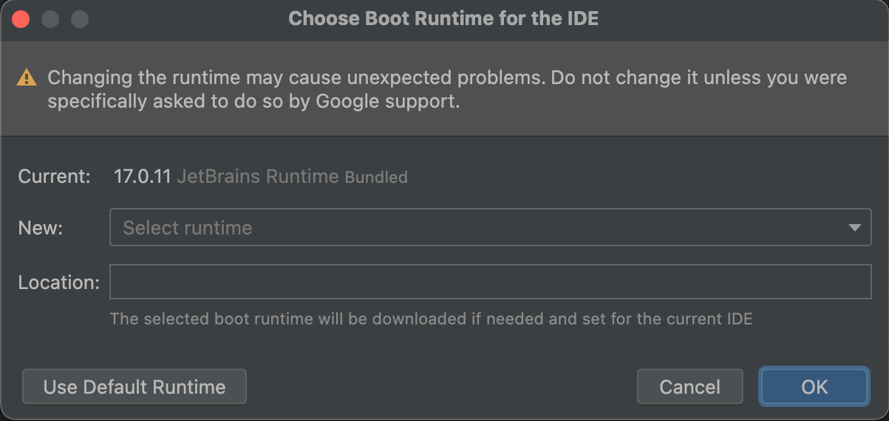

## Fixing the Refact.ai Plugin in JetBrains IDEs without JCEF

### Changing the JBR in JetBrains IDEs to Fix the Markdown Plugin

After installing the Refact.ai plugin in JetBrains IDEs, you may receive a notification indicating that the plugin is not functioning correctly.

To utilize chat functionality, JCEF - [Java Chromium Embedded Framework](https://plugins.jetbrains.com/docs/intellij/jcef.html) - is required. JCEF is pre-bundled in the JDK (also referred to as JBR - JetBrains Runtime) with IntelliJ IDEA versions starting from 2020.2.

The solution is to bundle the IDE with a JBR that integrates JCEF.

Fortunately, the JBR can be modified, and JetBrains provides the JBRs for download. JetBrains also offers a [guide to change JBR](https://intellij-support.jetbrains.com/hc/en-us/articles/206544879-Selecting-the-JDK-version-the-IDE-will-run-under), although compatibility with all versions of the IDE may vary.

### Choosing the Boot Java Runtime:

1. Open the menu **Help** > **Find Action…** (`⇧ Shift` + `⌘ Cmd` + `A`) and search for “Choose Boot Java Runtime for the IDE…” and execute it.
2. In the dialog, open the drop-down **Select runtime**.
   Note: It is advisable to select the same JBR version that was originally set as default in the IDE.
   
3. Either accept the default selection or choose one that includes JCEF in its title. Confirm your choice by clicking OK.
   
4. After downloading and installing, you must apply the changes by selecting **Restart now**.
   

You are now ready to enjoy the complete Refact.ai experience.

### Disabling the JCEF Sandbox

It is highly probable that you will encounter the following message after restarting the IDE:

To resolve this issue:
* Open the menu **Help** > **Find Action…** (`⇧ Shift` + `⌘ Cmd` + `A`) and search for “Registry…” and execute it.
* Locate the key `ide.browser.jcef.sandbox.enable` by typing the initial letters or scrolling through the list.
* Disable this key.

* Close the Registry Editor.
* Restart the IDE.