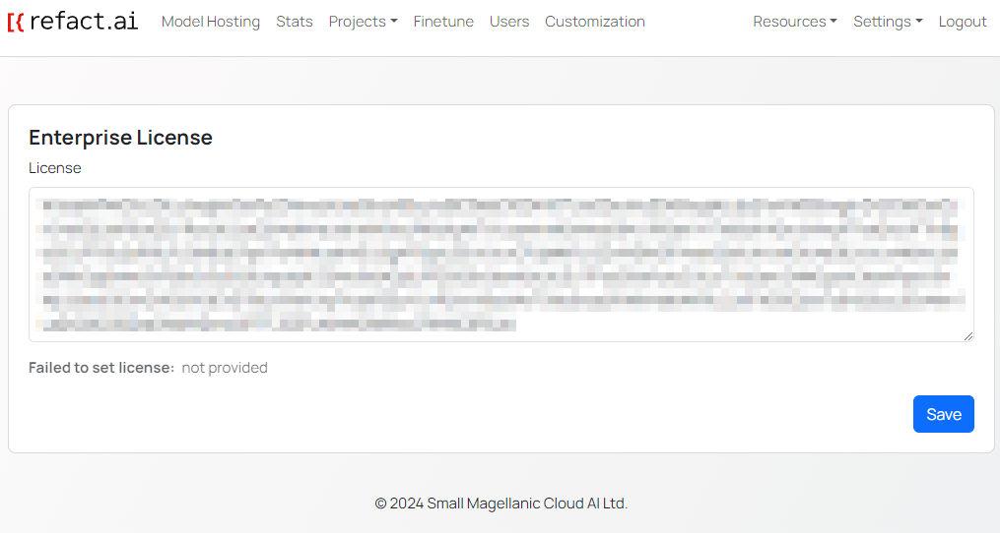

## Enter your license key
Navigate to the **License** page through the **Settings** drown menu in the top right corner and input your license key.

## Check Activation
After activation, you will see the **number of users** and the **expiration date** for your license.

## Need an Enterprise License?
If you don't have an enterprise license key, please [contact](https://refact.ai/contact/) the Refact team to get one.