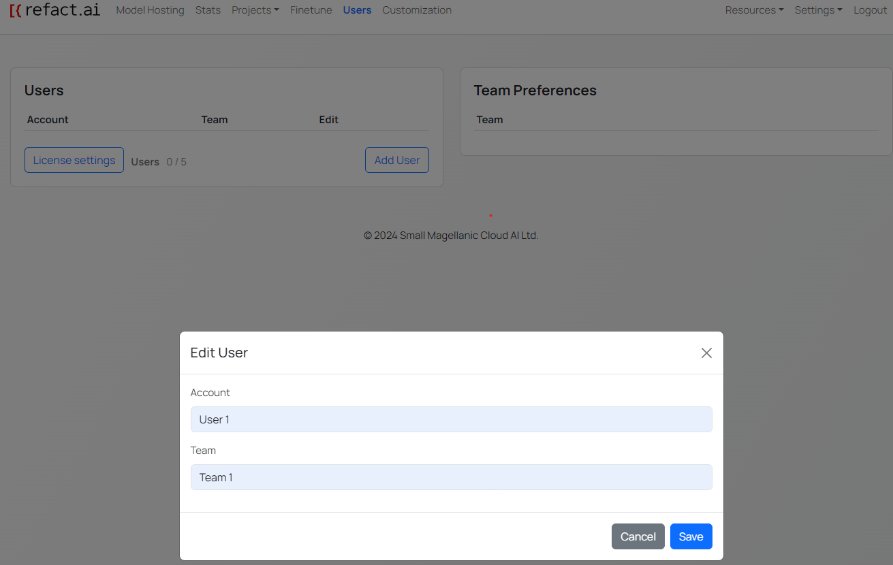
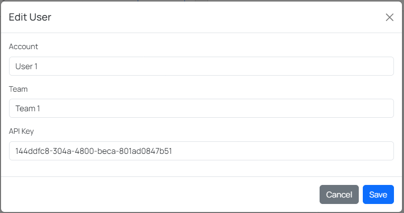
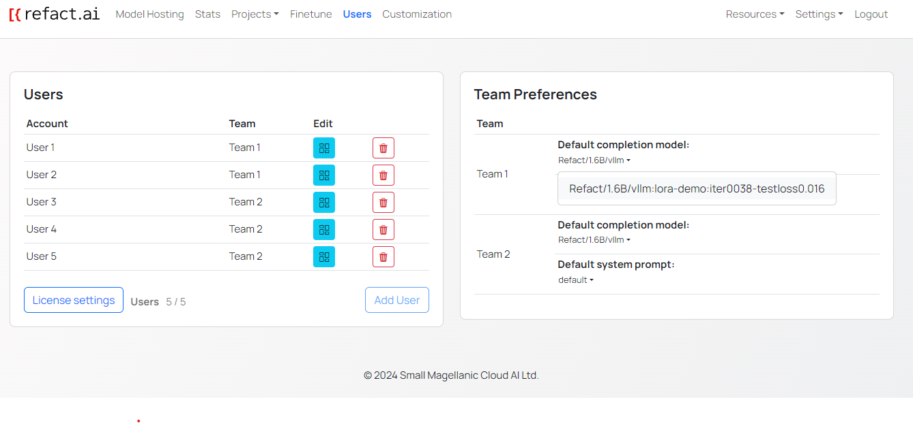

Refact.ai enterprise edition allows you to create and manage users. You are able to create users, assign them to teams, and manage their access to the platform.

The amount of users you can create is configured in the license. If you are not sure what is the amount of users associated with your license, please [contact the Refact team](https://refact.ai/contact/).

## Create a user

1. Navigate to the **Users** tab.
2. Click the **Add user** button.
3. Enter the **user's name** and the **team** to which the user will be assigned.

5. Click the **Save** button.

:::note
You can change the **team** to which the user will be assigned after creating the user. Press the **Edit** button associated with the user and type the new team name and click the **Save** button.
:::

## Retrevieng the API key of a user

For admins, you can retrieve the API key of a user to share with users to complete the authorization process. To retrieve the API key of a user:

1. Navigate to the **Users** tab.
2. Click the **Edit** button associated with the user.
3. Copy the API key. That value will be used to complete the authorization process in the IDE.

## Advanced Authentication

For advanced authentication, refer to the [Keycloak Integration guide](https://docs.refact.ai/guides/authentication/keycloak/).

## Assigning models and LoRAs to users

You can different models and LoRAs to teams. To assign models and LoRAs use the following guide:

1. Navigate to the **Users** tab.
2. On the right side of the page locate the **Team Preferences** section.

By default, the base model that is configured on **Model Hosting** page is assigned to all teams. To assign a LoRA to a team, click the name of the model under the **Default Completion Model** section. In the dropdown menu, select the LoRA that you want to assign to the specific team.

