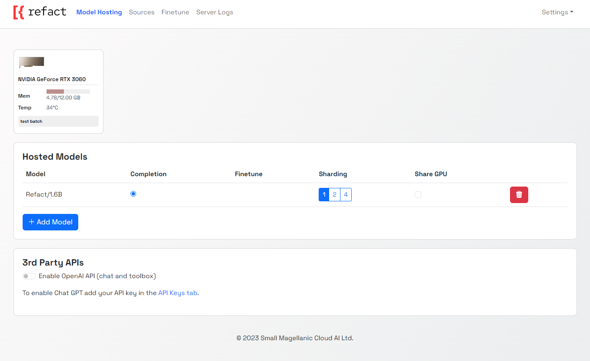

Self-hosted version of Refact is a more flexible option with additional features. It allows you to create fine-tuned models for your specific task. 

Self-hosted version is designed for developers who want to have a full control over their Refact experience.

## Prerequisites
- Docker with GPU support

## Installation

The easiest way to run this server is a pre-build Docker image.

Install [Docker with NVidia GPU support](https://docs.nvidia.com/datacenter/cloud-native/container-toolkit/install-guide.html#docker). On Windows you need to install WSL 2 first, [one guide to do this](https://docs.docker.com/desktop/install/windows-install).

Run docker container with following command:

```bash
docker run -d --rm -p 8008:8008 -v perm-storage:/perm_storage --gpus all smallcloud/refact_self_hosting
```
:::note
`perm-storage` is a volume that is mounted inside the container. All the configuration files, downloaded weights and logs are stored here.
:::

To upgrade the docker, delete it using `docker kill XXX` (the volume `perm-storage` will retain your data), run `docker pull smallcloud/refact_self_hosting` and run it again.

Now you can visit http://127.0.0.1:8008 to see the server Web GUI.



:::note
Add yourself to docker group to run docker without sudo (works for Linux): `commandline sudo usermod -aG docker {your user}` 
List all containers: `commandline docker ps -a` 
Start and stop existing containers (stop doesn't remove them): `commandline docker start XXX docker stop XXX` 
Shows messages from a container: `commandline docker logs -f XXX` 
Remove a container and all its data (except data inside a volume): `commandline docker rm XXX` 
Check out or delete a docker volume: `commandline docker volume inspect VVV docker volume rm VVV`
:::

### Sharding

You can choose to deploy a model to several GPUs with sharding. Select the number of GPUs that you would like to run your model on by selecting 1,2 or 4 in the sharding menu.

### Shared GPU

To run several smaller models on one GPU, select the "share GPU" option from the menu next to the selected model.

### Connecting OpenAI API

If you have an OpenAI API key, you can connect it to Refact and use GPT-series models inside Refact.

:::note
With this integration you will send your data to 3rd party providers (OpenAI). To enable OpenAI integration, you should go to settings (top right) and set and save your API key for the server usage.
:::

## Custom Inference setup

Go to plugin settings and set up a custom inference URL http://127.0.0.1:8008

### JetBrains
Settings > Tools > Refact.ai > Advanced > Inference URL

### VSCode
Extensions > Refact.ai Assistant > Extension Settings > Infurl