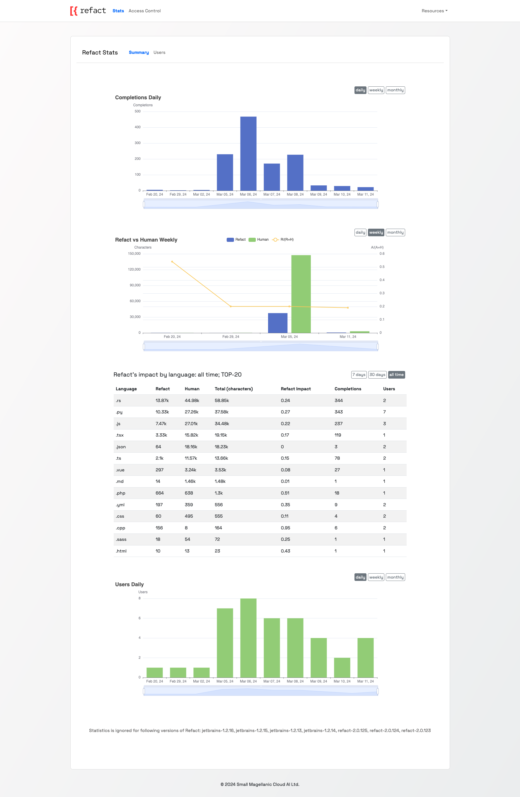
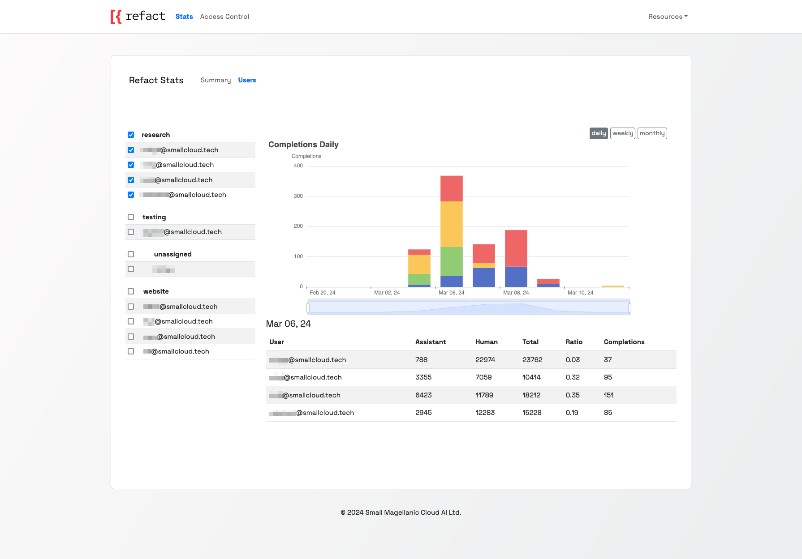
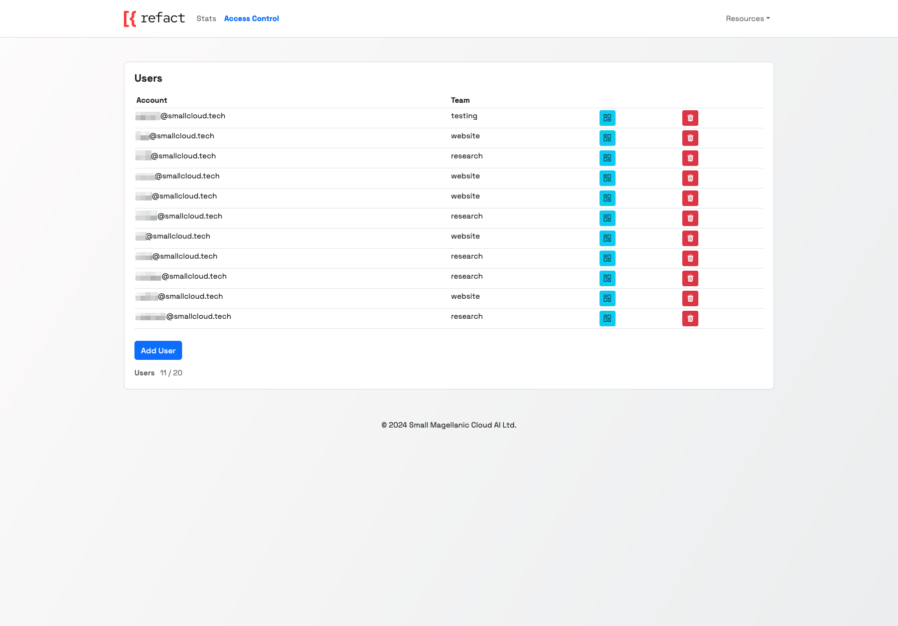
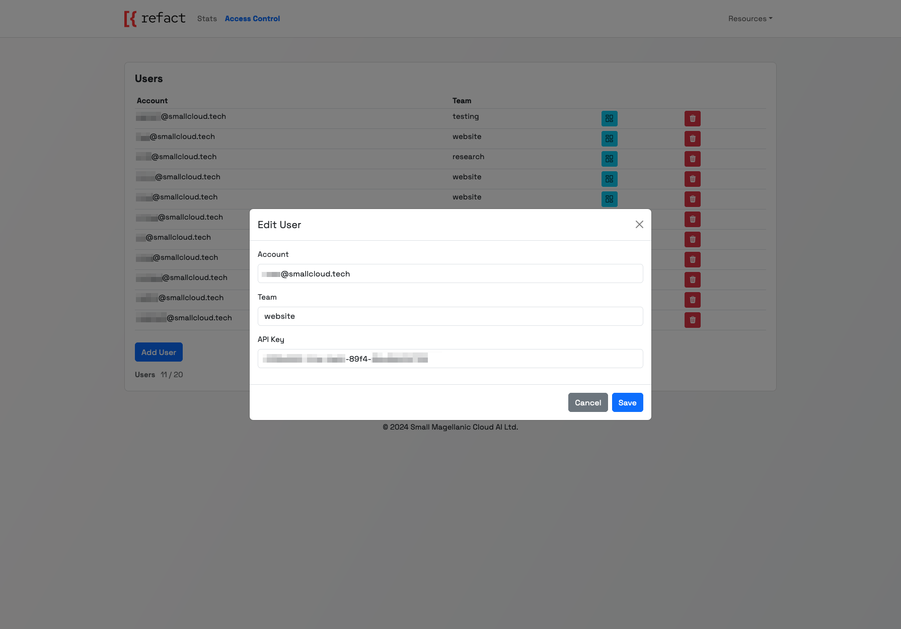
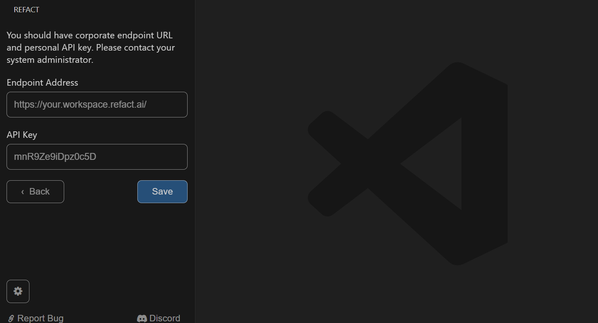

## Overview
Refact Teams enables your team to use an AI coding assistant powered by cloud inference without the need for a dedicated GPU.

## Creating a Team Account

To get started with Refact Teams, you'll need to create a team account. You can initiate this process by:
- Emailing us at: ilya@smallcloud.tech
- Messaging us on [Discord](https://smallcloud.ai/discord).

Upon contact, we will provide you a workspace link and password.

## How to Use Refact Teams

After setting up your team account, you can log in to access your workspace. The workspace is divided into two main sections:
- **Stats Dashboard**
- **Access Control**

The Stats dashboard offers comprehensive metrics to see the impact of Refact. It includes:
- **Completions Daily**: Track daily completions.
- **Refact vs Human Weekly**: Compare weekly coding contributions between Refact.ai coding assistant and team members.
- **Refact's Impact by Programming Language**: Understand how Refact assists across different languages.
- **Users Daily**: Monitor daily active users.

For detailed user-specific metrics, visit the Users tab within the Stats section.

## Access Control

Manage your team members' access through the Access Control page. Here, you can:

- **Add New Users**: Integrate new team members by specifying their account details and assigning them to a team.
- **Edit Existing Users**: Update user information as needed.

Each user has specific settings:
- **Account**: The email address associated with the user.
- **Team**: The specific team the user is part of.
- **API Key**: A unique key required for plugin authentication.

## Plugin Configuration

For using Refact Teams with your IDE, follow these instructions to set up the plugin when logging in:

1. **Select Refact Enterprise**: Choose `Refact Enterprise` within the plugin login options.
2. **Configuration Settings**:
    - **Inference URL**: Enter the URL provided for your team's workspace.
    - **API Key**: Input the API Key associated with your user from the Access Control page. Each team member will use their unique API Key for authentication.

After applying these settings, the plugin will be configured to work with Refact Teams.