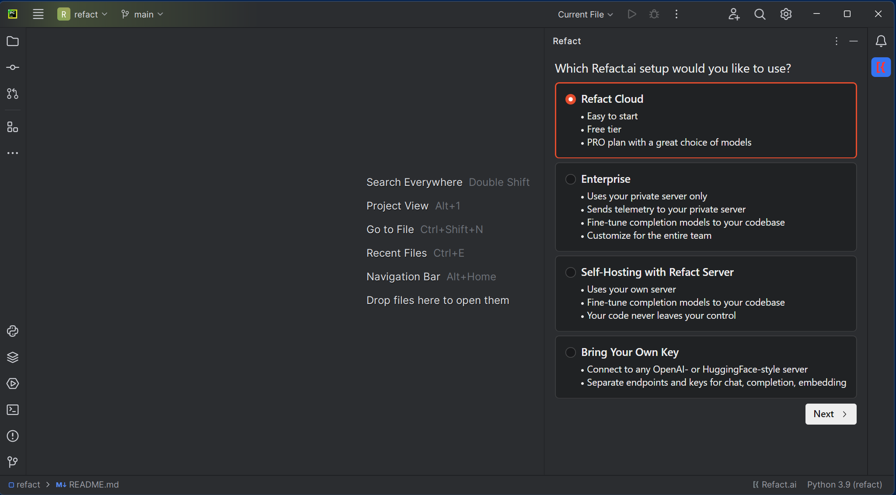
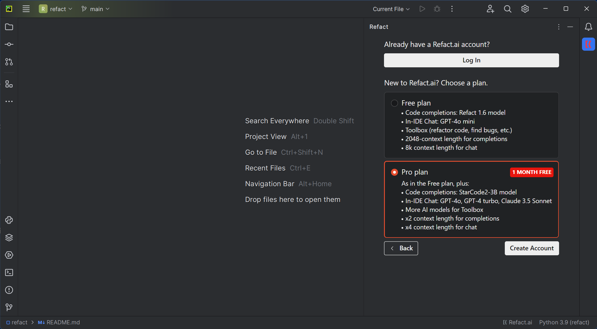
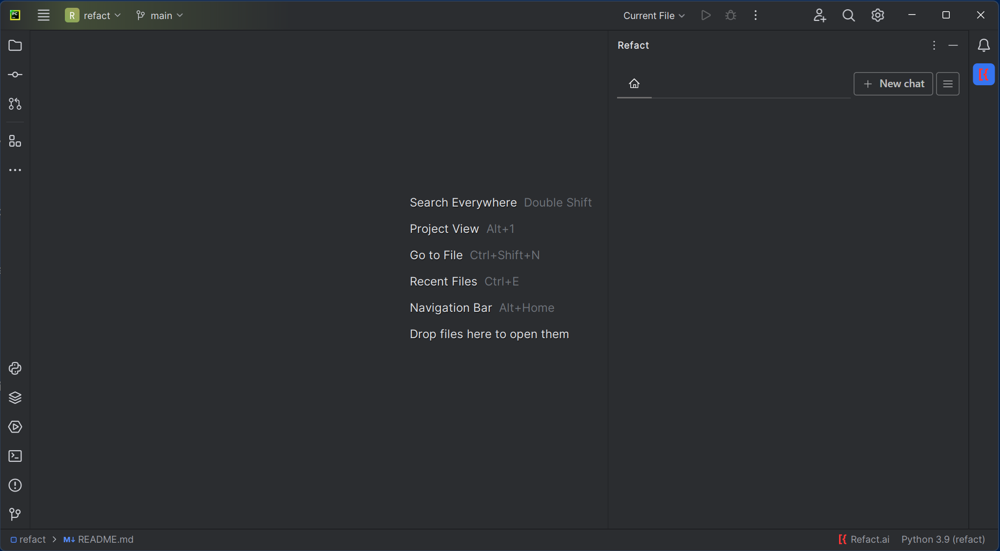
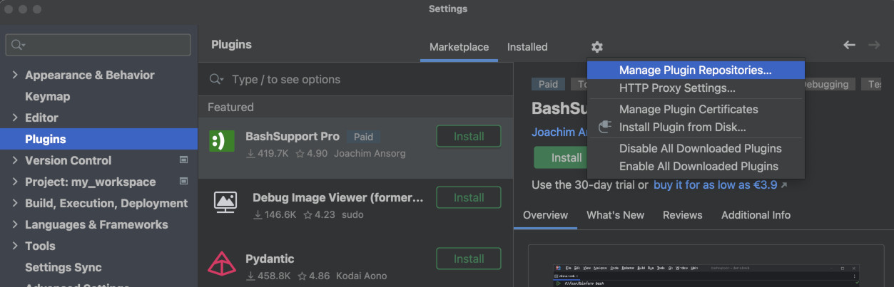

For JetBrains products, after installing the plugin from the [marketplace](https://plugins.jetbrains.com/plugin/20647-codify), press the Refact logo to open the UI of the plugin.

Pick one of the available versions and click the **Next** button.

The quickest way to get started is with **Cloud** option. When pressing the **Next** button, you will see an interface similar to the one below:

When pressing the **Login** or **Create Account** button, you will be redirected to the Refact's login page in your browser.

After completing the login process, the interface of the sidebar will change to the following:

For the Self-hosted and Enterprise options, follow one of the following guides:

- [Self-hosted Login](https://docs.refact.ai/guides/version-specific/self-hosted/#custom-inference-setup)
- [Enterprise Login](https://docs.refact.ai/guides/version-specific/enterprise/getting-started/#setting-up-the-plugins)

# Early Access Program

If you feel adventurous, add Early Access Program to your Plugins settings over here:

In a small window called "Custom Plugin Repositories" add "https://plugins.jetbrains.com/plugins/eap/list",
then update the plugin.

You will have access to the EAP version of the Refact plugin. Not guaranteed to work, but we try not to publish completely
dysfunctional versions in EAP either. Try new features, report how they work in discord!
