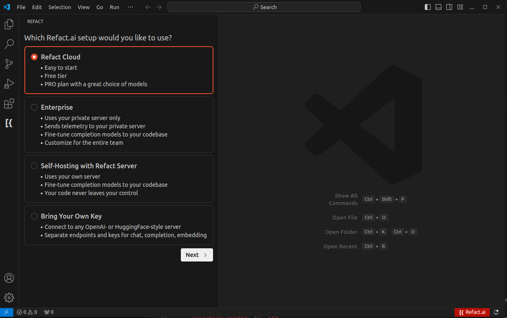
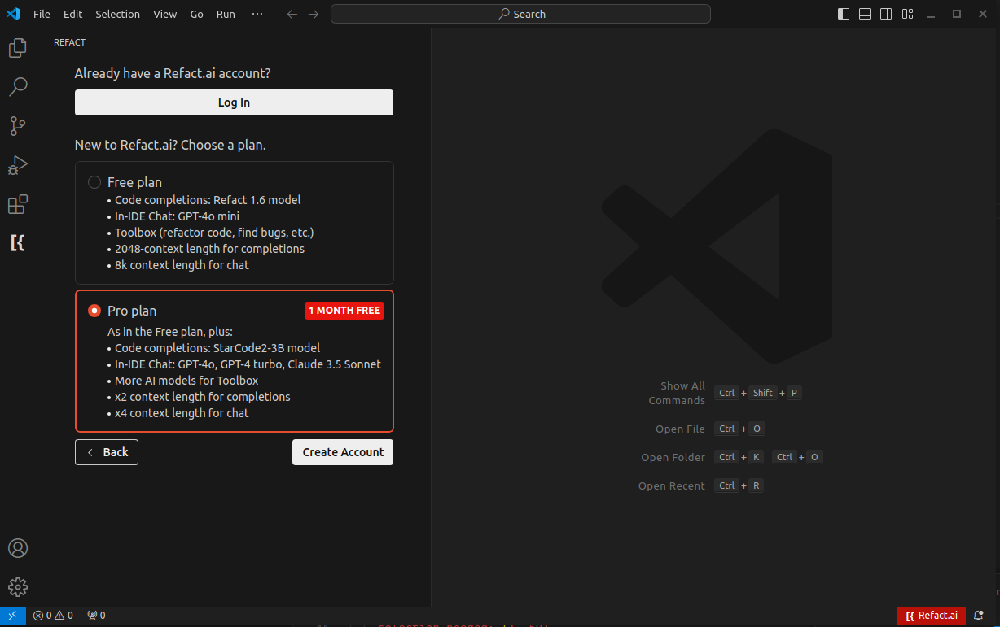
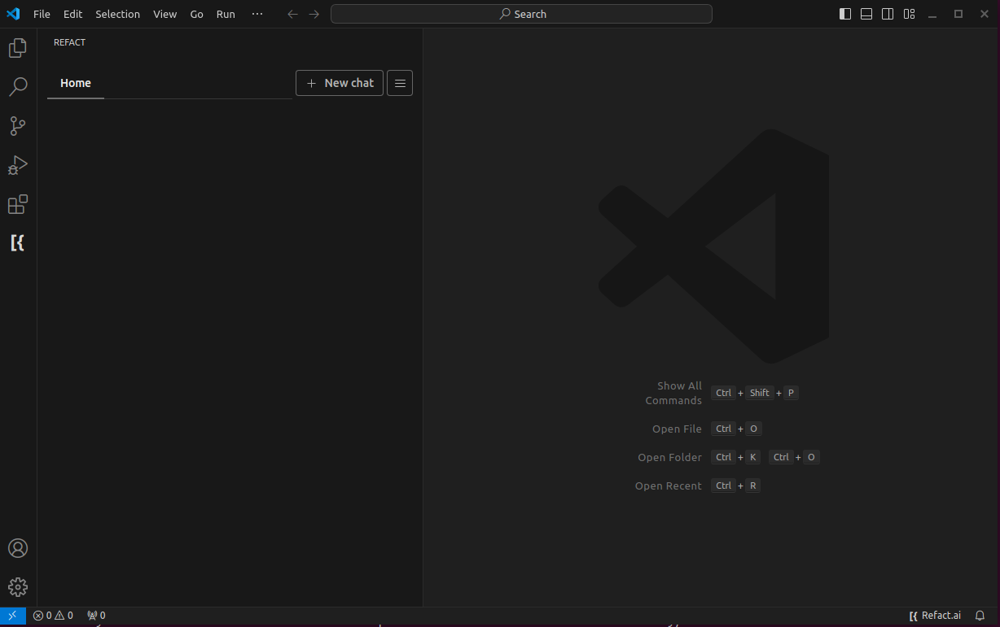

After installing the plugin from the [marketplace](https://marketplace.visualstudio.com/items?itemName=smallcloud.codify), press the Refact logo to open the UI of the plugin.

Pick one of the available versions and click the **Next** button.

The quickest way to get started is with **Cloud** option. When pressing the **Next** button, you will see an interface similar to the one below:

When pressing the **Login** or **Create Account** button, you will be redirected to the Refact's login page in your browser.

After completing the login process, the interface of the sidebar will change to the following:

For the Self-hosted and Enterprise options, follow one of the following guides:

- [Self-hosted Login](https://docs.refact.ai/guides/version-specific/self-hosted/#custom-inference-setup)
- [Enterprise Login](https://docs.refact.ai/guides/version-specific/enterprise/getting-started/#setting-up-the-plugins)