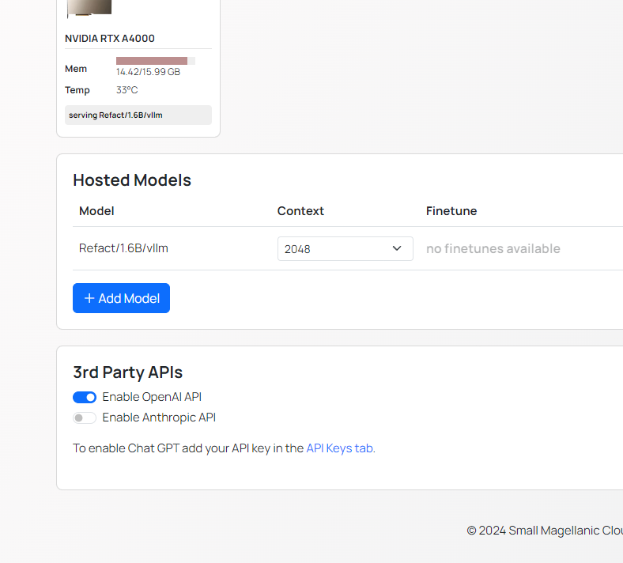

## Cloud Version

With Refact.ai, access state-of-the-art models in your VS Code or JetBrains plugin and select the optimal LLM for each task.

### AI Agent models
- GPT 4.1 (default)
- Claude 4 Sonnet
- GPT-4o
- o4-mini
- Gemini 2.5 Pro
- Gemini 2.5 Pro Preview

### Chat models
- GPT 4.1 (default)
- GPT-4.1 Mini
- GPT-4.1 Nano
- Claude 4 Sonnet  
- GPT-4o
- GPT-4o-mini
- o4-mini
- Gemini 2.5 Pro
- Gemini 2.5 Pro Preview

For select models, click the `💡Think` button to enable advanced reasoning, helping AI better solve complex tasks. Available only in [Refact.ai Pro plan](https://refact.ai/pricing/).

### Code completion models 
- Qwen2.5-Coder-1.5B

## BYOK (Bring your own key)

Refact.ai lets you connect your own API key and use any external LLM, including GPT, Claude, Gemini, Grok, DeepSeek, and others. It's easy: read the guide in our [BYOK Documentation](https://docs.refact.ai/byok/).

## Self-Hosted Version

In Refact.ai Self-hosted, you can choose among 20+ model options — ready for any task. The full lineup (always up-to-date) is in the [Known Models file on GitHub](https://github.com/smallcloudai/refact-lsp/blob/main/src/known_models.rs).

### Completion models 
<table class="full-table">
<thead>
<tr>
<th>Model Name</th>
<th>Fine-tuning support</th>
</tr>
</thead>
<tbody>
<tr>
<td>Refact/1.6B</td>
<td>✓</td>
</tr>
<tr>
<td>Refact/1.6B/vllm</td>
<td>✓</td>
</tr>
<tr>
<td>starcoder/1b/base</td>
<td>✓</td>
</tr>
<tr>
<td>starcoder/1b/vllm</td>
<td></td>
</tr>
<tr>
<td>starcoder/3b/base</td>
<td>✓</td>
</tr>
<tr>
<td>starcoder/3b/vllm</td>
<td></td>
</tr>
<tr>
<td>starcoder/7b/base</td>
<td>✓</td>
</tr>
<tr>
<td>starcoder/7b/vllm</td>
<td></td>
</tr>
<tr>
<td>starcoder/15b/base</td>
<td></td>
</tr>
<tr>
<td>starcoder/15b/plus</td>
<td></td>
</tr>
<tr>
<td>starcoder2/3b/base</td>
<td>✓</td>
</tr>
<tr>
<td>starcoder2/3b/vllm</td>
<td>✓</td>
</tr>
<tr>
<td>starcoder2/7b/base</td>
<td>✓</td>
</tr>
<tr>
<td>starcoder2/7b/vllm</td>
<td>✓</td>
</tr>
<tr>
<td>starcoder2/15b/base</td>
<td>✓</td>
</tr>
<tr>
<td>deepseek-coder/1.3b/base</td>
<td>✓</td>
</tr>
<tr>
<td>deepseek-coder/1.3b/vllm</td>
<td>✓</td>
</tr>
<tr>
<td>deepseek-coder/5.7b/mqa-base</td>
<td>✓</td>
</tr>
<tr>
<td>deepseek-coder/5.7b/vllm</td>
<td>✓</td>
</tr>
<tr>
<td>codellama/7b</td>
<td>✓</td>
</tr>
<tr>
<td>stable/3b/code</td>
<td></td>
</tr>
<tr>
<td>wizardcoder/15b</td>
<td></td>
</tr>
</tbody>
</table>

### Chat models
<table class="full-table">
<thead>
<tr>
<th>Model Name</th>
</tr>
</thead>
<tbody>
<tr>
<td>starchat/15b/beta</td>
</tr>
<tr>
<td>deepseek-coder/33b/instruct</td>
</tr>
<tr>
<td>deepseek-coder/6.7b/instruct</td>
</tr>
<tr>
<td>deepseek-coder/6.7b/instruct-finetune</td>
</tr>
<tr>
<td>deepseek-coder/6.7b/instruct-finetune/vllm</td>
</tr>
<tr>
<td>wizardlm/7b</td>
</tr>
<tr>
<td>wizardlm/13b</td>
</tr>
<tr>
<td>wizardlm/30b</td>
</tr>
<tr>
<td>llama2/7b</td>
</tr>
<tr>
<td>llama2/13b</td>
</tr>
<tr>
<td>magicoder/6.7b</td>
</tr>
<tr>
<td>mistral/7b/instruct-v0.1</td>
</tr>
<tr>
<td>mixtral/8x7b/instruct-v0.1</td>
</tr>
<tr>
<td>llama3/8b/instruct</td>
</tr>
<tr>
<td>llama3/8b/instruct/vllm</td>
</tr>
</tbody>
</table>

### Integrations

On a self-hosted mode, you can also configure **OpenAI** and **Anthropic API** integrations.

1. Go to **Model Hosting** page → **3rd Party APIs** section and toggle the switch buttons for **OpenAI** and/or **Anthropic**.

2. Click the **API Keys tab** to be redirected to the integrations page (or go via **Settings** → **Credentials**)

3. Enter your **OpenAI** and/or **Anthropic** key.

:::note
Make sure the switch button is enabled for each API you want to use — API keys won't be used unless activated.
:::
